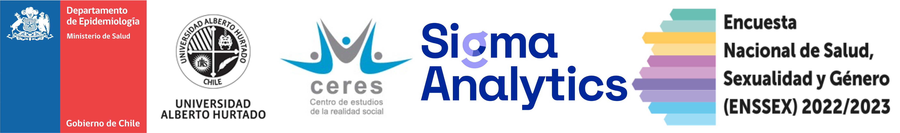

# DESENTRAÑANDO LA ENCUESTA NACIONAL DE SALUD, SEXUALIDAD Y GÉNERO 2022-2023: ANÁLISIS REPRODUCIBLES EN R

## WorkShop precongreso. Primer congreso chileno de estudios interdisciplinarios sobre diversidad sexual y de género.

{fig-align="center" width="900"}